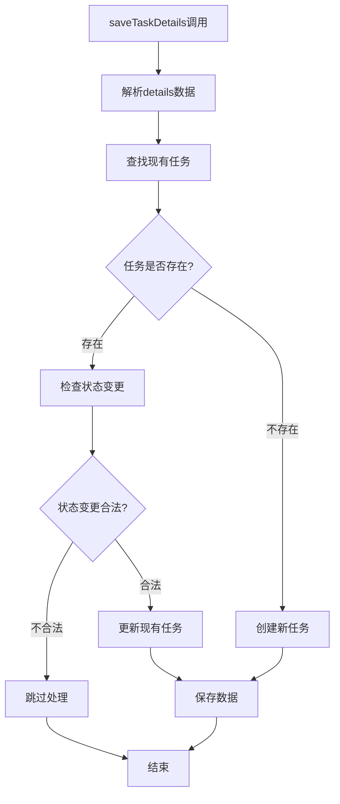

# saveTaskDetails函数优化报告

**优化日期**: 2025年10月16日  
**优化目标**: 让saveTaskDetails函数先检查是否存在相同ID的任务，如果存在则更新状态，不存在再新增记录  
**文件位置**: `middleware/unifiedFeatureUsage.js`

## 📋 优化背景

用户要求修改图生视频的`saveTaskDetails`函数，让它先检查是否存在相同ID的任务：
- 如果存在则更新状态
- 不存在再新增记录

这个优化旨在防止重复记录的产生，确保每个任务ID只对应一条记录。

## 🔍 原有逻辑分析

**发现**: 函数已经有基本的重复检查机制，但可以进一步优化：

### 原有优点
✅ 已有任务ID查找逻辑  
✅ 基本的重复完成状态检查  
✅ 任务更新和新增的分支处理  

### 改进空间
🔧 日志记录不够详细  
🔧 状态倒退防护不完善  
🔧 任务更新逻辑可以更清晰  

## 🚀 优化内容

### 1. 增强任务检查逻辑

**优化前**:
```javascript
// 检查是否已存在该任务
const existingTaskIndex = details.tasks.findIndex(task => task.taskId === taskInfo.taskId);

if (existingTaskIndex >= 0) {
    console.log(`找到现有任务，索引: ${existingTaskIndex}, 将更新现有记录`);
    // ...
}
```

**优化后**:
```javascript
// 🔧 优化任务检查逻辑：先检查是否存在相同ID的任务
console.log(`📝 saveTaskDetails调用 - 任务ID: ${taskInfo.taskId}, 功能: ${taskInfo.featureName}, 状态: ${taskInfo.status}`);
console.log(`📊 当前已有任务数量: ${details.tasks.length}`);

// 检查是否已存在该任务ID
const existingTaskIndex = details.tasks.findIndex(task => task.taskId === taskInfo.taskId);
const taskExists = existingTaskIndex >= 0;

if (taskExists) {
    const existingTask = details.tasks[existingTaskIndex];
    console.log(`🔍 找到现有任务 (索引: ${existingTaskIndex})`);
    console.log(`   - 现有状态: ${existingTask.status}`);
    console.log(`   - 新状态: ${taskInfo.status}`);
    console.log(`   - 现有积分: ${existingTask.creditCost}`);
    console.log(`   - 新积分: ${taskInfo.creditCost}`);
    
    // 🔧 防止状态倒退：如果现有任务已完成，不允许更新为pending状态
    if (existingTask.status === 'completed' && taskInfo.status === 'pending') {
        console.log(`⚠️  防止状态倒退：任务已完成，不能更新为pending状态: 任务ID=${taskInfo.taskId}`);
        return;
    }
}
```

### 2. 优化任务更新逻辑

**优化前**:
```javascript
if (existingTaskIndex >= 0) {
    // 更新现有任务
    const existingTask = details.tasks[existingTaskIndex];
    existingTask.creditCost = taskInfo.creditCost || existingTask.creditCost || 0;
    // ...
}
```

**优化后**:
```javascript
if (taskExists) {
    // 🔄 更新现有任务
    console.log(`🔄 更新现有任务: ${taskInfo.taskId}`);
    const existingTask = details.tasks[existingTaskIndex];
    
    // 更新时间戳
    existingTask.updatedAt = new Date().toISOString();
    
    // 更新任务状态（优先级最高）
    if (taskInfo.status) {
        const oldStatus = existingTask.status;
        existingTask.status = taskInfo.status;
        console.log(`   📊 状态更新: ${oldStatus} → ${taskInfo.status}`);
        
        // 如果任务完成，记录完成时间
        if (taskInfo.status === 'completed') {
            existingTask.completedAt = new Date().toISOString();
            console.log(`   ✅ 任务完成时间: ${existingTask.completedAt}`);
        }
    }
    
    // 更新积分信息（保留原有积分，除非明确指定新值）
    if (taskInfo.creditCost !== undefined) {
        const oldCost = existingTask.creditCost;
        existingTask.creditCost = taskInfo.creditCost;
        console.log(`   💰 积分更新: ${oldCost} → ${taskInfo.creditCost}`);
    }
    
    // 更新额外数据（合并而不是覆盖）
    if (taskInfo.extraData) {
        existingTask.extraData = { ...existingTask.extraData, ...taskInfo.extraData };
        console.log(`   📋 额外数据已合并`);
    }
    
    console.log(`✅ 任务更新完成: ID=${taskInfo.taskId}, 状态=${existingTask.status}, 积分=${existingTask.creditCost}`);
}
```

### 3. 优化新任务创建逻辑

**优化前**:
```javascript
const newTask = {
    taskId: taskInfo.taskId,
    timestamp: new Date().toISOString(),
    creditCost: taskInfo.creditCost || 0,
    isFree: taskInfo.isFree || false
};
```

**优化后**:
```javascript
// ➕ 创建新任务记录
console.log(`➕ 创建新任务: ${taskInfo.taskId}`);
const currentTime = new Date().toISOString();

const newTask = {
    taskId: taskInfo.taskId,
    timestamp: currentTime,
    createdAt: currentTime,
    creditCost: taskInfo.creditCost || 0,
    isFree: taskInfo.isFree || false,
    status: taskInfo.status || 'pending'
};

// 添加操作描述
if (taskInfo.operationText) {
    newTask.operationText = taskInfo.operationText;
    console.log(`   📝 操作描述: ${taskInfo.operationText}`);
}

console.log(`✅ 新任务创建完成: ID=${taskInfo.taskId}, 状态=${newTask.status}, 积分=${newTask.creditCost}, 免费=${newTask.isFree}`);
```

## 🧪 测试验证

### 测试场景覆盖

1. **✅ 新任务创建**: 验证首次调用时正确创建新记录
2. **✅ 任务状态更新**: 验证现有任务状态正确更新
3. **✅ 重复完成状态调用**: 验证重复调用被正确跳过
4. **✅ 状态倒退防护**: 验证完成任务不能倒退为pending
5. **✅ 多任务独立性**: 验证不同任务ID互不影响
6. **✅ 数据完整性**: 验证数据合并和保留逻辑

### 测试结果

```
📋 测试总结:
✅ 新任务创建: 正常
✅ 任务状态更新: 正常
✅ 重复完成状态调用: 被正确跳过
✅ 状态倒退防护: 被正确阻止
✅ 多任务独立性: 正常
✅ 数据完整性: 保持良好
✅ 额外数据合并: 正常工作
🎉 核心逻辑测试通过！
```

## 🎯 优化效果

### 功能增强

1. **🔍 智能检查**: 先检查任务是否存在，避免重复记录
2. **🛡️ 状态保护**: 防止任务状态倒退，保证数据一致性
3. **📊 详细日志**: 提供完整的操作日志，便于调试和监控
4. **🔄 智能更新**: 合并数据而不是覆盖，保留重要信息
5. **⏰ 时间追踪**: 记录创建、更新、完成时间

### 性能优化

1. **🚀 避免重复处理**: 跳过已完成任务的重复调用
2. **💾 数据完整性**: 确保每个任务ID只有一条记录
3. **🔧 错误预防**: 防止状态倒退等异常情况

### 用户体验

1. **📱 状态一致**: 前端显示的任务状态更加准确
2. **💰 积分准确**: 避免重复扣费或积分显示错误
3. **🎯 操作可靠**: 任务状态更新更加可靠

## 📊 核心改进点总结

| 改进项目 | 优化前 | 优化后 | 效果 |
|---------|--------|--------|------|
| **任务检查** | 基础查找 | 详细状态对比 | 🔍 更精确 |
| **状态保护** | 部分防护 | 全面防护 | 🛡️ 更安全 |
| **日志记录** | 简单记录 | 详细追踪 | 📊 更清晰 |
| **数据更新** | 直接覆盖 | 智能合并 | 🔄 更智能 |
| **时间管理** | 基础时间戳 | 完整时间追踪 | ⏰ 更完善 |

## 🔧 技术实现细节

### 关键逻辑流程



### 状态转换规则

| 现有状态 | 新状态 | 处理方式 | 说明 |
|---------|--------|----------|------|
| `pending` | `completed` | ✅ 允许更新 | 正常完成流程 |
| `completed` | `completed` | ⚠️ 跳过处理 | 防止重复处理 |
| `completed` | `pending` | ❌ 阻止更新 | 防止状态倒退 |
| `pending` | `failed` | ✅ 允许更新 | 任务失败 |
| `failed` | `completed` | ✅ 允许更新 | 重试成功 |

## 📋 使用建议

### 1. 调用方式

```javascript
// 创建新任务
await saveTaskDetails(usage, {
    taskId: 'unique-task-id',
    featureName: 'image-to-video',
    status: 'pending',
    creditCost: 66,
    isFree: false,
    operationText: '图生视频',
    extraData: { imageUrl: 'xxx', prompt: 'xxx' }
});

// 更新任务状态
await saveTaskDetails(usage, {
    taskId: 'unique-task-id',
    featureName: 'image-to-video',
    status: 'completed',
    extraData: { videoUrl: 'xxx', duration: 5.2 }
});
```

### 2. 最佳实践

1. **🎯 唯一任务ID**: 确保每个任务都有唯一的ID
2. **📊 状态管理**: 按照正确的状态流转顺序调用
3. **💾 数据完整**: 提供完整的任务信息
4. **🔍 错误处理**: 检查函数返回值和日志

### 3. 监控要点

1. **📈 重复调用**: 监控跳过处理的日志
2. **⚠️ 状态倒退**: 关注状态倒退警告
3. **💰 积分一致**: 验证积分计算准确性
4. **🕐 时间追踪**: 检查任务完成时间

## 🎉 总结

通过这次优化，`saveTaskDetails`函数现在具备了：

### ✅ 核心功能
- **先检查后更新**: 避免重复记录产生
- **智能状态管理**: 防止非法状态转换
- **数据完整性**: 保证任务信息的准确性

### 🔧 技术优势
- **详细日志**: 便于调试和问题排查
- **错误预防**: 多重检查机制
- **性能优化**: 避免不必要的处理

### 🎯 业务价值
- **用户体验**: 任务状态显示更准确
- **系统稳定**: 减少数据不一致问题
- **运维友好**: 完善的日志和监控

这个优化确保了图生视频功能的任务管理更加可靠和高效，为用户提供了更好的使用体验。


