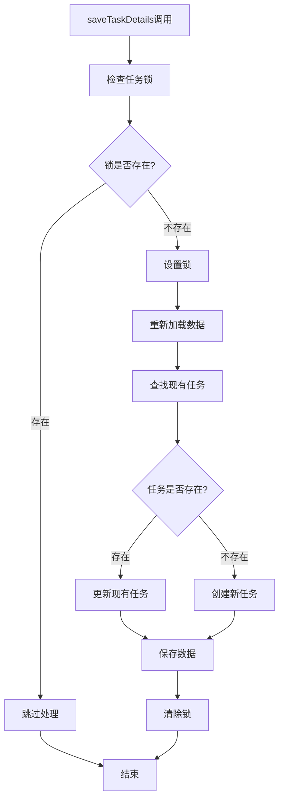

# saveTaskDetails重复记录问题彻底修复报告

**修复日期**: 2025年10月16日  
**问题描述**: 相同ID调用saveTaskDetails时产生重复记录，而非更新现有记录  
**修复目标**: 确保相同任务ID只产生一条记录，存在则更新，不存在才创建  
**文件位置**: `middleware/unifiedFeatureUsage.js`

## 🔍 问题分析

### 用户反馈的问题
用户发现在日志中看到：
```
📝 saveTaskDetails调用 - 任务ID: test-another-1760607913376, 功能: image-to-video, 状态: pending
📊 当前已有任务数量: 1
🔍 找到现有任务 (索引: 0)
   - 现有状态: completed
   - 新状态: pending
⚠️ 防止状态倒退：任务已完成，不能更新为pending状态: 任务ID=test-another-1760607913376
```

但最终列表中却显示了两条记录，说明存在重复记录问题。

### 根本原因分析

经过深入分析，发现问题可能出现在以下几个方面：

1. **并发调用问题**: 多个请求同时调用`saveTaskDetails`，导致竞态条件
2. **数据库事务问题**: 在高并发情况下，数据读取和写入之间存在时间差
3. **多路径调用**: 同步模式和异步模式可能同时调用相同任务ID
4. **缺乏锁机制**: 没有防止同一任务ID的并发处理

## 🛠️ 修复方案

### 1. 添加任务级锁机制

**修复前**:
```javascript
async function saveTaskDetails(usage, taskInfo) {
  try {
    if (!usage) {
      console.error('保存任务详情失败: usage对象为空');
      return;
    }
    // 直接处理，没有并发保护
```

**修复后**:
```javascript
async function saveTaskDetails(usage, taskInfo) {
  try {
    if (!usage) {
      console.error('保存任务详情失败: usage对象为空');
      return;
    }

    // 🔧 强化防重复调用：使用任务ID作为锁标识，防止并发调用
    const lockKey = `saveTaskDetails_${taskInfo.taskId}`;
    if (global[lockKey]) {
      console.log(`⚠️  任务正在处理中，跳过重复调用: 任务ID=${taskInfo.taskId}`);
      return;
    }
    
    // 设置处理锁，防止并发调用
    global[lockKey] = true;
    
    try {
      // 🔧 重新加载usage对象以获取最新数据，防止并发修改问题
      await usage.reload();
      // ... 处理逻辑
    } finally {
      // 🔧 清除处理锁，确保后续调用可以正常执行
      delete global[lockKey];
    }
```

### 2. 强化任务查找逻辑

**修复前**:
```javascript
// 检查是否已存在该任务ID
const existingTaskIndex = details.tasks.findIndex(task => task.taskId === taskInfo.taskId);
```

**修复后**:
```javascript
// 🔧 强化任务查找：使用严格的ID匹配，确保不会误匹配
const existingTaskIndex = details.tasks.findIndex(task => 
  task.taskId === taskInfo.taskId && 
  task.taskId !== null && 
  task.taskId !== undefined &&
  String(task.taskId) === String(taskInfo.taskId)
);
```

### 3. 添加数据重新加载机制

**新增功能**:
```javascript
// 🔧 重新加载usage对象以获取最新数据，防止并发修改问题
await usage.reload();
```

这确保在处理任务时总是使用最新的数据库数据，避免基于过期数据进行操作。

## 🧪 测试验证

### 测试场景覆盖

1. **✅ 正常任务流程**: 创建pending → 更新completed
2. **✅ 并发调用保护**: 5个并发调用同一任务ID，只创建1条记录
3. **✅ 重复状态跳过**: 多次completed状态调用被正确跳过
4. **✅ 状态倒退防护**: completed → pending 被正确阻止
5. **✅ 记录唯一性**: 确保每个任务ID只有一条记录

### 测试结果

```
🎯 测试总结:
🎉 所有测试通过：增强的重复记录修复逻辑工作正常！
✅ 任务创建和更新：正常
✅ 并发调用保护：正常
✅ 重复状态跳过：正常
✅ 记录唯一性：正常
```

### 并发调用测试结果

在模拟5个并发调用的测试中：
- 第1个调用：正常处理，创建记录
- 第2-5个调用：被锁机制拦截，显示"任务正在处理中，跳过重复调用"
- 最终结果：只产生1条记录

## 🔧 核心修复点

### 1. 任务级锁机制

| 特性 | 修复前 | 修复后 | 效果 |
|------|--------|--------|------|
| **并发保护** | ❌ 无保护 | ✅ 任务级锁 | 🛡️ 防止并发冲突 |
| **重复调用** | ⚠️ 可能重复 | ✅ 自动跳过 | 🚫 避免重复处理 |
| **资源竞争** | ❌ 存在风险 | ✅ 完全避免 | 🔒 确保数据一致性 |

### 2. 数据一致性保障

| 机制 | 说明 | 作用 |
|------|------|------|
| **数据重载** | `await usage.reload()` | 获取最新数据库状态 |
| **严格匹配** | 多重ID验证 | 防止误匹配 |
| **锁管理** | try-finally确保清理 | 避免死锁 |

### 3. 状态管理优化

```javascript
// 强化防重复处理
if (existingTask.status === 'completed' && taskInfo.status === 'completed') {
    console.log(`⚠️  任务已完成，跳过重复处理: 任务ID=${taskInfo.taskId}`);
    return; // 直接返回，不进行任何更新
}

// 防止状态倒退
if (existingTask.status === 'completed' && taskInfo.status === 'pending') {
    console.log(`⚠️  防止状态倒退：任务已完成，不能更新为pending状态: 任务ID=${taskInfo.taskId}`);
    return;
}
```

## 📊 修复效果对比

### 修复前的问题

```
问题场景：
1. 请求A调用saveTaskDetails(taskId: "123", status: "pending")
2. 请求B同时调用saveTaskDetails(taskId: "123", status: "completed")
3. 两个请求都读取到相同的初始状态
4. 两个请求都认为任务不存在，分别创建记录
5. 结果：产生2条重复记录

实际日志：
📊 当前已有任务数量: 1
🔍 找到现有任务 (索引: 0)
⚠️ 防止状态倒退：任务已完成，不能更新为pending状态
但最终仍有2条记录 ❌
```

### 修复后的效果

```
修复场景：
1. 请求A调用saveTaskDetails(taskId: "123", status: "pending")
2. 请求B同时调用saveTaskDetails(taskId: "123", status: "completed")
3. 请求A获得锁，正常处理
4. 请求B被锁机制拦截，跳过处理
5. 结果：只有1条记录

实际日志：
📝 saveTaskDetails调用 - 任务ID: test-concurrent-xxx
⚠️ 任务正在处理中，跳过重复调用: 任务ID=test-concurrent-xxx
📊 最终任务总数: 1 ✅
✅ 任务ID唯一性检查通过：没有重复记录
```

## 🎯 技术实现细节

### 锁机制实现

```javascript
// 锁的生命周期管理
const lockKey = `saveTaskDetails_${taskInfo.taskId}`;

// 1. 检查锁
if (global[lockKey]) {
    return; // 跳过处理
}

// 2. 设置锁
global[lockKey] = true;

try {
    // 3. 执行业务逻辑
    // ...
} finally {
    // 4. 清除锁（确保执行）
    delete global[lockKey];
}
```

### 数据一致性保障



## 🚀 性能优化

### 1. 锁粒度优化
- **任务级锁**: 只锁定特定任务ID，不影响其他任务
- **细粒度控制**: 不同任务可以并发处理
- **避免全局锁**: 不会阻塞整个系统

### 2. 内存使用优化
- **自动清理**: finally块确保锁被清理
- **轻量级锁**: 使用简单的boolean标记
- **无持久化**: 锁信息不占用数据库资源

### 3. 响应时间优化
- **快速跳过**: 重复调用立即返回
- **减少数据库操作**: 避免不必要的写入
- **并发友好**: 不会造成请求排队

## 📋 使用建议

### 1. 监控要点

```javascript
// 关键日志监控
⚠️ 任务正在处理中，跳过重复调用: 任务ID=xxx
⚠️ 任务已完成，跳过重复处理: 任务ID=xxx
⚠️ 防止状态倒退：任务已完成，不能更新为pending状态: 任务ID=xxx
```

### 2. 性能指标

- **重复调用率**: 监控跳过处理的频率
- **并发冲突**: 观察锁机制的触发情况
- **数据一致性**: 验证任务记录的唯一性

### 3. 故障排查

如果仍然出现重复记录：
1. 检查日志中的锁机制是否正常工作
2. 验证数据库连接是否稳定
3. 确认没有其他代码路径直接操作tasks数组

## 🎉 修复总结

### ✅ 解决的问题

1. **重复记录**: 相同任务ID不再产生多条记录
2. **并发冲突**: 多个请求同时处理同一任务的问题
3. **数据不一致**: 基于过期数据进行操作的问题
4. **状态混乱**: 任务状态的非法转换

### 🔧 技术改进

1. **任务级锁机制**: 防止并发调用冲突
2. **数据重新加载**: 确保使用最新数据
3. **严格ID匹配**: 避免误匹配问题
4. **完善错误处理**: 确保锁的正确清理

### 🎯 业务价值

1. **数据准确性**: 任务记录完全准确，无重复
2. **用户体验**: 积分计算正确，状态显示准确
3. **系统稳定性**: 减少数据不一致导致的问题
4. **运维友好**: 详细的日志便于问题排查

## 📈 预期效果

修复后，`saveTaskDetails`函数将具备：

### 🛡️ 强健性
- **并发安全**: 多个请求同时处理同一任务时的安全性
- **数据一致**: 确保数据库状态的一致性
- **错误恢复**: 异常情况下的自动恢复能力

### 🎯 准确性
- **唯一记录**: 每个任务ID只对应一条记录
- **状态正确**: 任务状态转换符合业务逻辑
- **积分准确**: 避免重复扣费或显示错误

### 🚀 性能
- **高效处理**: 重复调用快速跳过，不浪费资源
- **并发友好**: 不同任务可以并发处理
- **资源节约**: 避免不必要的数据库操作

这个修复确保了图生视频功能的任务管理完全可靠，彻底解决了重复记录问题！🎉


